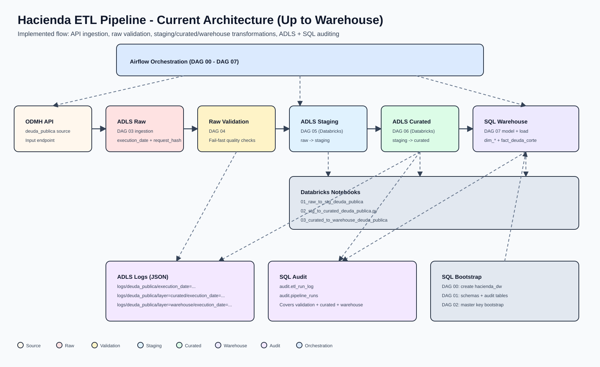

# Hacienda ETL Pipeline

Production-oriented ETL pipeline for `deuda_publica`, orchestrated with Airflow, transformed in Databricks, persisted in ADLS Gen2, and loaded into a SQL Server warehouse model.

## Current Status
The implemented flow currently reaches the `warehouse` layer (`DAG 07`) with technical auditing in both ADLS JSON logs and SQL audit tables.

## High-Level Architecture


### Flow Summary
`ODMH API -> ADLS Raw -> Raw Validation -> ADLS Staging -> ADLS Curated -> SQL Warehouse`

`Audit outputs -> ADLS logs + SQL tables (raw_validation, curated, warehouse).`

## Implemented Scope (Current)
- Source ingestion from ODMH API to ADLS raw.
- Raw data validation with fail-fast behavior.
- Raw-to-staging Databricks transformation.
- Staging-to-curated Databricks transformation.
- Curated-to-warehouse Databricks load with warehouse-model bootstrap in SQL.
- Technical audit persisted in ADLS JSON and SQL (`audit.etl_run_log`, `audit.pipeline_runs`).

## Repository Structure
```text
.
├── airflow/
│   ├── dags/
│   │   ├── 00_create_data_warehouse_dag.py
│   │   ├── 01_create_schemas_dag.py
│   │   ├── 02_bootstrap_warehouse_security_dag.py
│   │   ├── 03_ingest_deuda_publica_dag.py
│   │   ├── 04_validate_raw_deuda_publica_dag.py
│   │   ├── 05_staging_deuda_publica_databricks_dag.py
│   │   ├── 06_curated_deuda_publica_dag.py
│   │   └── 07_warehouse_deuda_publica_dag.py
│   ├── plugins/
│   │   ├── audit/
│   │   ├── curated/
│   │   ├── deuda_publica/
│   │   └── warehouse/
│   └── sql/
│       ├── schemas/
│       ├── staging/
│       └── warehouse/
├── docs/
│   └── diagrams/
├── docker/
├── docker-compose.yml
└── README.md
```

## DAG Catalog
| DAG ID | Layer / Purpose | Main Output |
|---|---|---|
| `00_create_data_warehouse` | Bootstrap SQL database | `hacienda_dw` database |
| `01_create_schemas` | Bootstrap base schemas and audit tables | `stg`, `mart`, `audit.etl_run_log`, `audit.pipeline_runs` |
| `02_bootstrap_warehouse_security` | Bootstrap SQL security objects for warehouse operations | Database master key in `hacienda_dw` |
| `03_ingest_deuda_publica_raw` | API ingestion to raw | `raw/deuda_publica/execution_date=YYYY-MM-DD/...` |
| `04_validate_raw_deuda_publica` | Raw quality checks + audit | Validation report in ADLS/SQL |
| `05_staging_deuda_publica_databricks` | Raw -> staging Databricks transform | `staging/deuda_publica/execution_date=YYYY-MM-DD/...` |
| `06_curated_deuda_publica` | Staging -> curated Databricks transform + audit | `curated/deuda_publica/execution_date=YYYY-MM-DD/...` + ADLS/SQL audit |
| `07_warehouse_deuda_publica` | Warehouse model bootstrap + curated -> warehouse Databricks load + audit | `warehouse.dim_*`, `warehouse.fact_deuda_corte` + ADLS/SQL audit |

## Data Layers
### Raw
- API payloads stored as JSON with metadata.
- Partitioned by `execution_date` and `request_hash`.

### Staging
- Databricks normalized output from raw.
- Partitioned by `execution_date`.

### Curated
- Business standardization over staging entities.
- Partitioned by `execution_date`.

### Warehouse
- SQL Server dimensional model in schema `warehouse`.
- Includes dimensions (`dim_*`) and fact table (`fact_deuda_corte`).

## Audit & Observability
### ADLS JSON Logs
- Raw validation: `logs/deuda_publica/execution_date=YYYY-MM-DD/...`
- Curated run audit: `logs/deuda_publica/layer=curated/execution_date=YYYY-MM-DD/...`
- Warehouse run audit: `logs/deuda_publica/layer=warehouse/execution_date=YYYY-MM-DD/...`

### SQL Audit
- `audit.etl_run_log` for technical run tracking.
- `audit.pipeline_runs` for pipeline lifecycle tracking.

## Runtime Prerequisites
- Docker and Docker Compose.
- Airflow with Microsoft SQL Server and Databricks providers.
- SQL Server reachable from Airflow.
- Databricks workspace, cluster, and notebooks available.
- ADLS Gen2 account and containers (`raw`, `staging`, `curated`, `logs` as applicable).

## Local Startup
```bash
docker compose up -d --build
```
Airflow UI: `http://localhost:8080`

## Airflow Setup
### Connections (`Admin -> Connections`)
1. `sqlserver_hacienda`: Type `Microsoft SQL Server`, configured with your SQL Server host, port, database, user, and password.
2. `databricks_hacienda`: Type `Databricks`, using workspace host + PAT token (`Login=token`, `Password=<PAT>`).
3. `azure_datalake_conn`: Service Principal connection with `Login=<client_id>`, `Password=<client_secret>`, and Extra JSON `{"tenant_id":"<tenant-id>"}`.

### Variables (`Admin -> Variables`)
1. `AZURE_STORAGE_ACCOUNT_URL`: Example `https://<storage-account>.dfs.core.windows.net`.
2. `AZURE_FILE_SYSTEM_NAME`: File system used by raw validation and curated/warehouse audit logs.
3. `azure_storage_account`: Storage account name used by Databricks notebook parameters.

### Environment Variables (`.env` / container env)
1. `ADLS_ACCOUNT_NAME`
2. `ADLS_TENANT_ID`
3. `ADLS_CLIENT_ID`
4. `ADLS_CLIENT_SECRET`
5. `ADLS_RAW_CONTAINER`
6. `SQLSERVER_SA_PASSWORD`

## Databricks Setup
- Ensure the configured cluster ID exists and is running.
- Ensure the notebook paths referenced by DAGs are valid in your workspace.
- Current notebooks expected by DAGs:
1. `01_raw_to_stg_deuda_publica`
2. `02_stg_to_curated_deuda_publica.py`
3. `03_curated_to_warehouse_deuda_publica`
- Ensure cluster identity has RBAC permissions for ADLS read/write.

## Recommended Execution Order
1. `00_create_data_warehouse`
2. `01_create_schemas`
3. `02_bootstrap_warehouse_security`
4. `03_ingest_deuda_publica_raw`
5. `04_validate_raw_deuda_publica`
6. `05_staging_deuda_publica_databricks`
7. `06_curated_deuda_publica`
8. `07_warehouse_deuda_publica`

## Validation Checklist
After running the flow for one `execution_date`:
1. RAW JSON files exist in `raw/deuda_publica/execution_date=YYYY-MM-DD/`.
2. `04_validate_raw_deuda_publica` succeeds or fails with explicit quality errors.
3. Staging data exists in `staging/deuda_publica/execution_date=YYYY-MM-DD/`.
4. Curated data exists in `curated/deuda_publica/execution_date=YYYY-MM-DD/`.
5. Warehouse tables in schema `warehouse` contain data for the processed execution date.
6. ADLS audit logs exist for validation, curated, and warehouse stages.
7. SQL audit rows were inserted into `audit.etl_run_log`.

## Troubleshooting
1. `Path not found` in curated/warehouse transformations: verify upstream layer data exists for the same `execution_date`.
2. Databricks errors (`cluster not found`, notebook path invalid, permissions): verify cluster state, notebook path, and RBAC.
3. SQL audit insertion errors: re-run `01_create_schemas` and validate `audit.etl_run_log` exists in `hacienda_dw`.
4. Warehouse model errors: run `00_create_data_warehouse`, `01_create_schemas`, and `07_warehouse_deuda_publica` in sequence.

## Security Note
Do not store secrets, PAT tokens, private notebook paths, or personal identifiers in version-controlled files.
